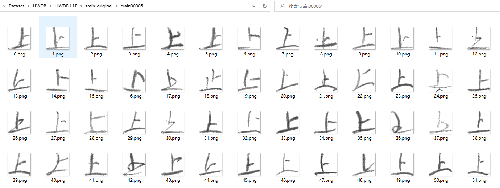
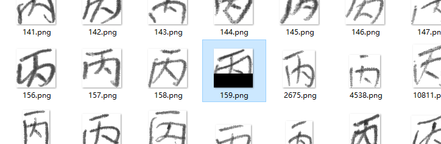
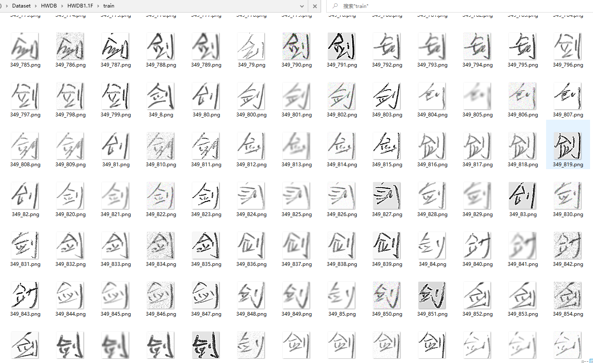
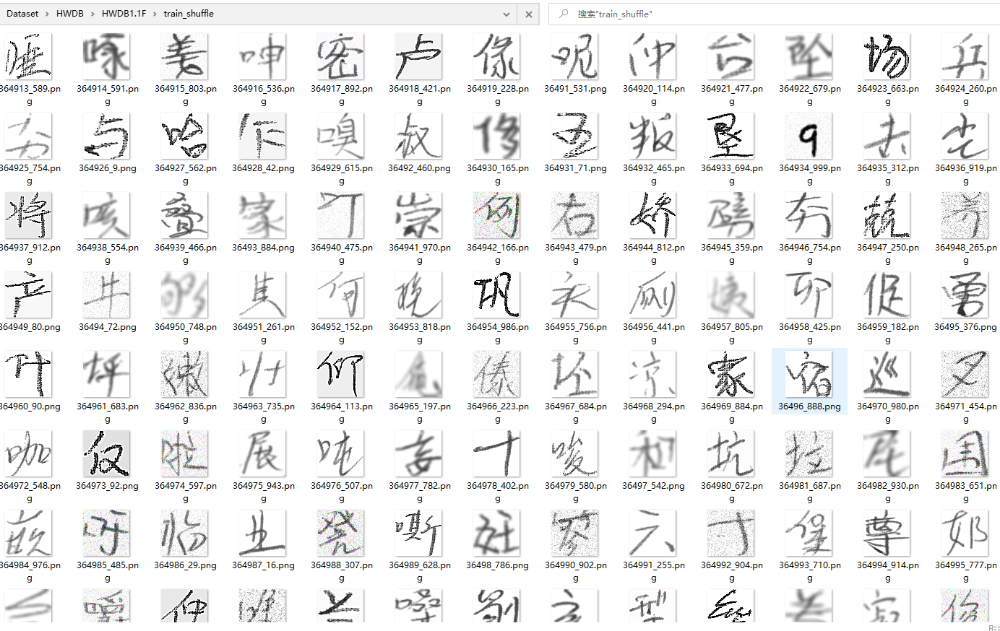
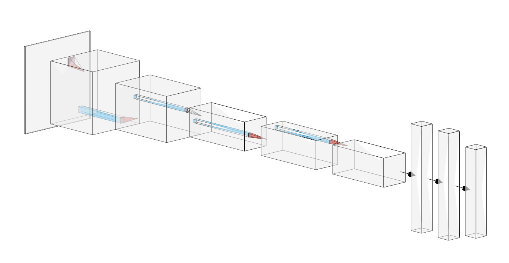
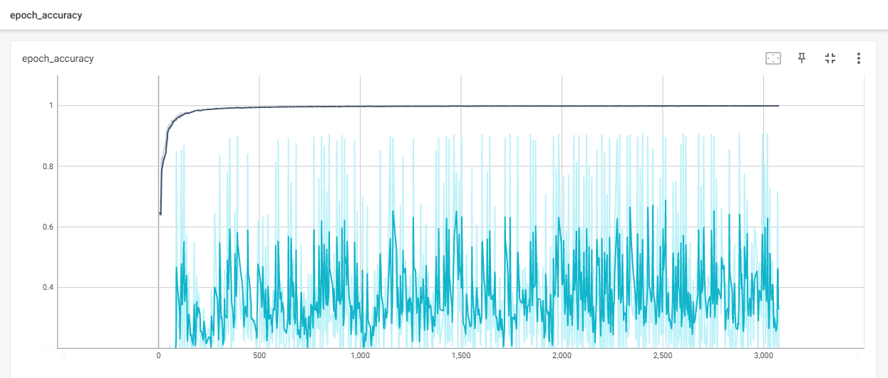
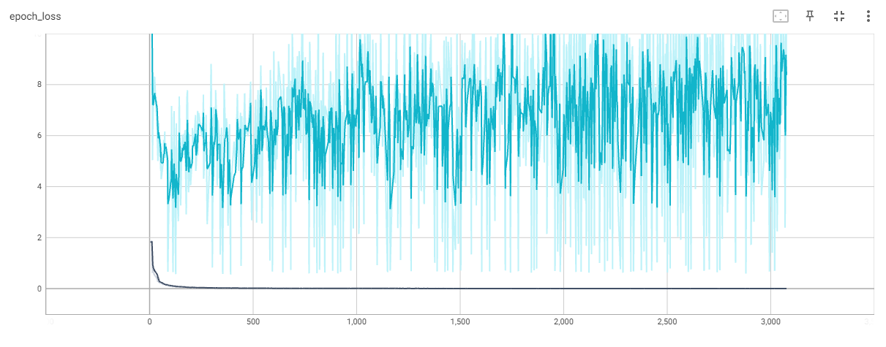
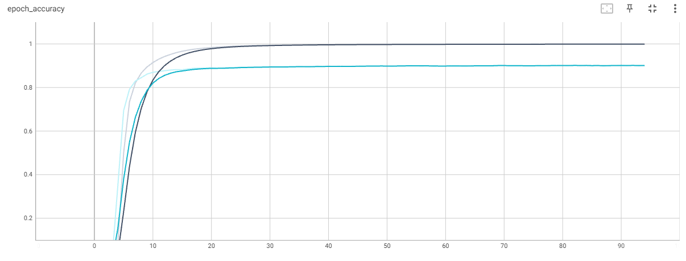
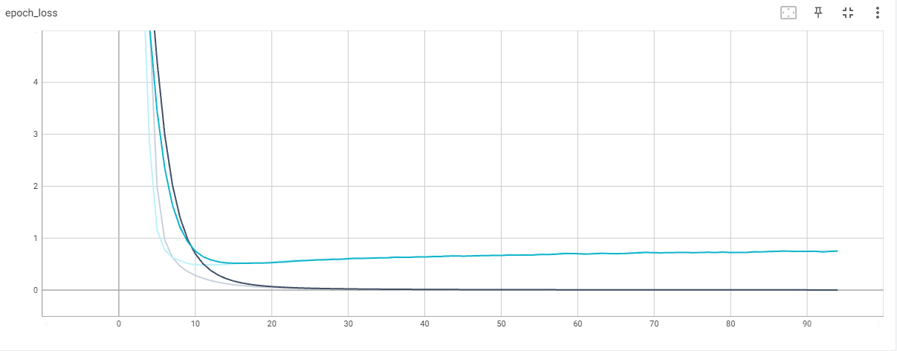

# 2021机器学习课程项目-基于深度学习的中文手写体识别

## 项目架构

```txt
├───.idea          #idea工程配置文件夹
│   └───inspectionProfiles
├───cannopy        #忽略 其他项目文件临时存放
├───checkpoints    #权重 保存点 存储文件夹
├───dataset        #数据集处理相关
│   ├───HWDB       #中科院HWDB手写数据集处理
│   ├───HW_SELF    #手写中文处理
│   ├───MNIST      #MNIST数字数据集
│   └───TFrecord   #制作TFrecord转储文件
├───fisher         #fisher代码
└───train_DL       #训练代码
    ├───assets     #验证集存储位置
    └───logs    #训练日志存储位置
```

## 项目基本信息

### 运行电脑配置

| 配置 |                型号                |
| :--: | :--------------------------------: |
| CPU  |          Intel i7-10750H           |
| GPU  | NVIDIA GeForce RTX 3060 Laptop 6GB |
| RAM  |           KINGSTOM 16GB            |
| SSD  |          HP SSD EX950 1TB          |

### 第三方库

|    库名称     |  库版本  |    库简介    |
| :-----------: | :------: | :----------: |
|  tensorflow   |  2.6.0   | 深度学习框架 |
|     keras     |  2.6.0   | 深度学习框架 |
|     numpy     |  1.19.5  |   矩阵计算   |
|    Pillow     |  8.4.0   | 图像基础操作 |
| opencv-python | 4.5.4.58 | 图像基础操作 |
|    imgaug     |  0.4.0   |   图像增强   |

## 数据集

为了保证在神经网络训练的过程中，有足够多的样本图片进行训练操作，本项目采用了两个互联网公开数据集。

分别为**CASIA-HWDB**与**MNIST**数据集，两个数据集均进行了图片预处理与图片增强，并且统一将所有图片resize为(64，64)的图片大小。

### MNIST数据集

MNIST 数据集来自美国国家标准与技术研究所, 数据集由来自 250 个不同人手写的数字构成, 其中 50% 是高中学生, 50% 来自人口普查局的工作人员。其中已经预先按照8:2的比例分配好了训练集与验证集，每张图片都是28\*28的分辨率，为了配合HWDB数据集，在之后的操作中，会将所有图片放缩为64\*64的图片大小。

### CASIA-HWDB数据集

CASIA-HWDB数据集为中科院自动化研究所创建，主要收集了成年人手写简体中文汉字的图片，并对每个单独中文简体汉字进行切割。每个图片在数据集里由多个属性构成，分别为图片大小、字符标识号、图片宽度、图片高度、Bitmap格式的图片五个部分组成，所以为了增强图片并重新与HWDB数据集混合，需要将所有图片进行解压操作。该数据集格式如图1。与MNIST数据集类似，HWDB数据集同样预先分好了训练集与验证集，因此不需要再此分配。


## 数据集准备工作

**请注意：** 考虑到正则表达式的复杂性，在该工程中的所有路径都是绝对路径的处理，如需复现需要手动更改相关路径

1. 首先处理MNIST数据集 ，从该网址[MNIST数据集](http://yann.lecun.com/exdb/mnist/)下载四个文件到本地目录

2. 修改/dataset/MNIST/process.py 中5-6行解压目标目录 8-11行数据集本地存在的路径后运行该文件

3. 修改/dataset/MNIST/resize.py 中5-6行训练集或验证集存在路径 并运行进行resize操作

4. 处理MNIST数据集较为简单，仅需要做一次resize操作，在完成HWDB数据集工作后，将训练集与验证集分别复制到对应的目录即可

5. 接着处理HWDB数据集，从该网址[HWDB数据集](http://www.nlpr.ia.ac.cn/databases/handwriting/Home.html)下载HWDB1.1两个文件到本地目录

6. 修改/dataset/HWDB/process.py 中6行保存目录以及57 65行输出文件目录并运行，获得解压后的所有图片，并且每个单字的图片存入对应的文件夹，如图2。

   

   **注意：** 在后续图片处理过程中，发现“丙”字内有一张图片错误，尚不清楚造成的原因，在本项目中直接将此图删除，错误图片如图3。

   

7. 将MNIST数据集复制到本文件夹，并将0-9分别对应重命名为train(test)03755-train(test)03765

   **注意：** 不同版本的pickle序列化工具会导致问题，并且为了后续的简便操作，这里是直接使用了其他项目给出的词汇表，一行对应一个字，我们要做的在该文件后加上0-9十行，该文件为/dataset/characters.txt。

8. 修改/dataset/HWDB/pictureEnhance.py 中 10行数据集存放路径 29-30行获取标签 39行新的存储路径并运行 对所有图片进行统一的数据处理及增强

   1. 将3通道RGB图转换为1通道灰度图

   2. 首先进行一次resize为64\*64的操作并存储

   3. 在此基础上添加高斯噪声并存储

   4. 在此基础上使用锐化操作并存储

   5. 完成以上工作后能看到如图4的形式，所有图片都是64\*64的像素，每张图片都生成了四张新的图片

      

9. 因为生成的数据集是完全没有被打乱的，每个连续的类大约有1000张图片，生成TFrecord文件后无法完全打乱。因此需要手动locally shuffle，该步骤的原理将在后续章节后给出原因。修改/dataset/HWDB/shuffle.py 中5 17行数据集存储路径，6行目标路径后运行进行打乱。

10. 在完成以上步骤后，数据集如图5所示，已经被完全打乱。

    

    因为涉及到大量的IO，代码运行时间依系统CPU与磁盘能力决定。

    **注意：** 请提前将整个数据集目录从系统索引/Everything索引中移除，否则会导致更大的系统负荷

## TFrecord制作

### TFrecord格式

虽然MNIST数据集可以一次性全部放入内存，但对于大多数的训练项目来说这是不可能的。因此为了高效地读取数据，比较有帮助的一种做法是对数据进行序列化并将其存储在一组可线性读取的文件（每个文件 100-200MB）中。这尤其适用于通过网络进行流式传输的数据。这种做法对缓冲任何数据预处理也十分有用。TFRecord 格式是一种用于存储二进制记录序列的简单格式。

### 制作TFrecord

修改/dataset/makeTFRecord.py 中 8行存储位置及文件名 15行图片存储位置后运行，运行两次分别生成train.tfrecord与test.tfrecord。

## 神经网络架构

### AlexNet

本项目主要参考了AlexNet这篇深度学习奠基作，在该文中主要提出了以下几个特色：

1. 在数据集方面，引入了数据增强操作
2. 采用ReLU函数代替Sigmoid函数，实质上更方便计算且克服sigmoid函数在0-1之间难以训练的问题
3. 引入Dropout防止过拟合
4. 构建了一个相对深的卷积网络及庞大的全连接网络
5. 使用局部响应归一化

## 本项目所用架构

因为考虑到原文输入图像大小是256\*256大小的图片，本项目使用的是64\*64，所以在实际过程中对原网络进行了一点调整

架构图如图6



架构框架如下：
|    Layer (type)      |  Output Shape  |    Param #    |
| :-----------: | :------: | :----------: |
| conv2d (Conv2D)   |  (None, 20, 20, 96)   | 4800 |
| max_pooling2d (MaxPooling2D)     |  (None, 9, 9, 96)   | 0 |
|conv2d_1 (Conv2D)|(None, 9, 9, 256)|614656|
|max_pooling2d_1 (MaxPooling2D)|(None, 4, 4, 256)|0|
|conv2d_2 (Conv2D)  |(None, 4, 4, 384)|885120   |
|conv2d_3 (Conv2D)|(None, 4, 4, 384)|  1327488 |
|conv2d_4 (Conv2D)| (None, 4, 4, 256) |884992  |
|max_pooling2d_2 (MaxPooling2D)| (None, 2, 2, 256)|0|
|flatten (Flatten) |(None, 1024)|0|
|dense (Dense) |(None, 4096)|4198400|
|dropout (Dropout) |(None, 4096)|0|
|dense_1 (Dense)|(None, 4096)|16781312|
|dropout_1 (Dropout) |(None, 4096) |0|
|dense_2 (Dense) |(None, 1000)|4097000  |

|params|
| :-----------: |
|Total params: 28,793,768|
|Trainable params: 28,793,768|
|Non-trainable params: 0|

## 训练过程

训练代码为\train_DL\train.py，同样请自行修改代码中的对应路径。具体代码见注释，不做过多赘述。

验证代码为\train_DL\demo.py，同样请自行修改代码中的对应路径。需要注意的是当验证每张图片时，需要在前后各加一个维度升到四维空间[batch, height, width, channels]

## 实验结果

### 未打乱的数据集

未打乱的数据集使用官方shuffle()实现打乱，但仍然快速拟合，训练集在1小时后趋向0.99，而验证集正确率与loss都在剧烈震荡，如图7，8





### 打乱后的数据集

在查阅相关资料后，发现官方实现的shuffle并不能很好的处理这种情况，故我们实现了本地shuffle后再写入TFrecord文件，新的实验结果如图9，10





## 参考文献

1. Krizhevsky A, Sutskever I, Hinton G E. Imagenet classification with deep convolutional neural networks[J]. Advances in neural information processing systems, 2012, 25: 1097-1105.
2. LeCun Y, Bottou L, Bengio Y, et al. Gradient-based learning applied to document recognition[J]. Proceedings of the IEEE, 1998, 86(11): 2278-2324.
3. <https://github.com/ageron/handson-ml2> Machine Learning Notebooks
4. <https://github.com/jjcheer/ocrcn_tf2/> TensorFlow 2.0 中文手写字识别（汉字OCR）
5. <https://github.com/CCP101/bank_number_Identification> 一种基于深度学习的银行卡号端对端识别系统
6. <https://github.com/orange90/HandWrittenChineseRecogntion> 用Keras实现手写汉字识别
7. <https://www.bilibili.com/video/BV1hq4y157t1> AlexNet论文逐段精读【论文精读】
8. <http://cs231n.stanford.edu/> CS231n: Convolutional Neural Networks for Visual Recognition
9. <https://cs230.stanford.edu/>  CS230 Deep Learning
